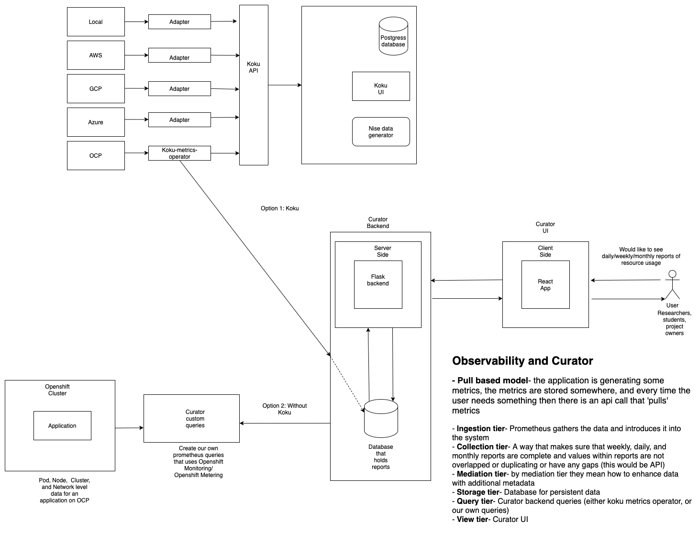

# Curator Architecture

*Figure 1: Curator front-end with data collection through koku-metrics-operator.*

### More on koku-metrics-operator

1. What does it do?
  -  Operator that obtains OCP usage data and uploads it into koku.

2. What does test data look like?
  - https://github.com/project-koku/koku-metrics-operator/blob/aca6be66fd6025a1698abfb223654fe9c8ca2bee/collector/test_files/test_data/pod-limit-cpu-cores

3. How does koku-metrics operator query information directly without using Operator metering
  - https://github.com/project-koku/koku-metrics-operator/blob/master/docs/csv-description.md
  - Collects data from prometheus through prometheus queries (https://github.com/project-koku/koku-metrics-operator/blob/master/collector/queries.go)
