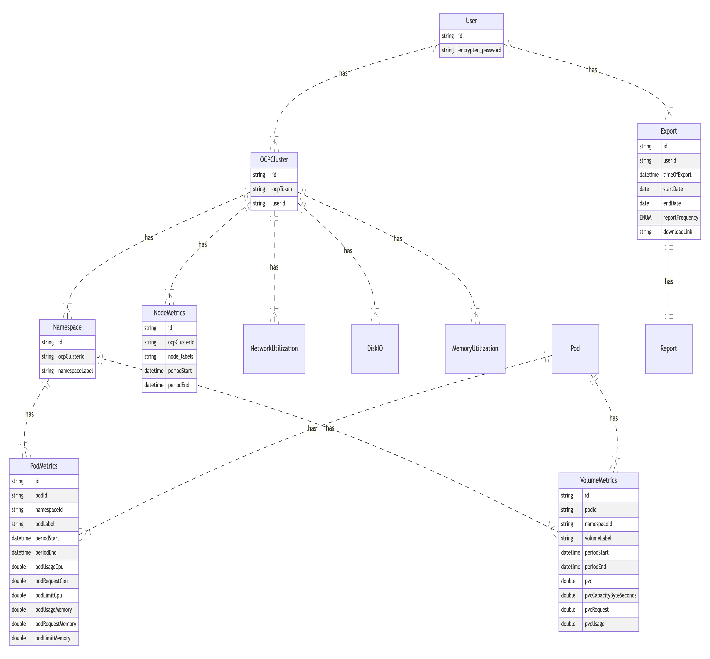

# Report Lifecycle

### Purpose

The purpose of this document is to understand the report structure of reports being generated, define metrics that will be displayed, and define the lifecycle of reports for a user.

#### Lifecycle of reports
For the sake of efficiency and maintenance, a hot and cold storage system will be used. The customer or the curator team should be able to define how old information is deleted from hot storage based on a time threshold. If a user requires clarification of resource usage prior to that, the cold storage would need to be accessed. This would be an exported version of the database (stored in S3 for example). There should be a routine daily check automated that removes data that would need to be archived.

### Data collection, processing, storage

There are two potential ways to retrieve data from koku-metrics-operator into Curator database.

1. Extract Transform Load - Retrieve raw data from koku as csv, transform it before reaching the database (process the data), then load it to database. The effort here is in the beginning so you are storing the clean data.

2. Extract Load Transform - Retrieve raw data from koku as csv, load raw into database and then transform it in place. With this option you can either have a copy of the raw as well as the processed metric or you can transform the raw in place without extra memory.


*Figure 1: Curator database with data collection through koku-metrics-operator.*

In the model, a user has multiple clusters with resource usage data of the cluster that can be queried at different report frequencies. A sample query for the model in which user retrieves cpu usage metrics at the pod level for a daily report frequency. daily_start and daily_end values would be defined by the backend based on user specification.

```
SELECT*
FROM PodMetrics metrics
JOIN Namespace ns on metrics.namespaceId = ns.ID
JOIN OCPCluster cluster on ns.ocpClusterId = cluster.id
WHERE periodStart = <daily_start>
AND periodEnd = <daily_end>
```

Diagram in Figure 1 was built in Mermaid Live Editor with the following markdown.

```
erDiagram
    User ||..|{ OCPCluster : has
    OCPCluster ||..|{ Namespace : has
    OCPCluster ||..|{ NodeMetrics : has
    OCPCluster ||..|{ NetworkUtilization : has
    OCPCluster ||..|{ DiskIO : has
    OCPCluster ||..|{ MemoryUtilization : has

    Namespace ||..|{ PodMetrics : has
    Namespace ||..|{ VolumeMetrics : has
    Pod ||..|{ VolumeMetrics : has
    Pod ||..|{ PodMetrics : has

    User ||..|{ Export : has
    Export ||..|| Report : has


    User {
        string id
        string encrypted_password
    }

    OCPCluster {
        string id
        string ocpToken
        string userId
    }

    Namespace {
        string id
        string ocpClusterId
        string namespaceLabel
    }

    PodMetrics {
        string id
        string podId
        string namespaceId
        string podLabel
        datetime periodStart
        datetime periodEnd
        double podUsageCpu
        double podRequestCpu
        double podLimitCpu
        double podUsageMemory
        double podRequestMemory
        double podLimitMemory
    }

    VolumeMetrics {
        string id
        string podId
        string namespaceId
        string volumeLabel
        datetime periodStart
        datetime periodEnd
        double pvc
        double pvcCapacityByteSeconds
        double pvcRequest
        double pvcUsage
    }

    NodeMetrics {
        string id
        string ocpClusterId
        string node_labels
        datetime periodStart
        datetime periodEnd
    }

    Export {
        string id
        string userId
        datetime timeOfExport
        date startDate
        date endDate
        ENUM reportFrequency
        string downloadLink
    }
```
