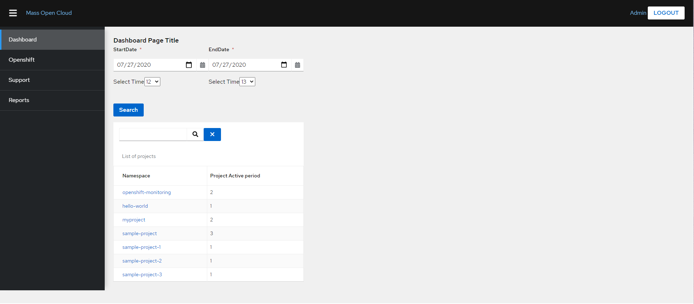

# SSMT-UI




## Quick-start
```bash
git clone https://github.com/EMURP/SSMT-UI.git # clone the project
cd SSMT-UI # navigate into the project directory
npm install # install project dependencies
npm run start:dev # start the development server
```

## Login

To login, use one of the following username/password combinations.

* Username = admin, password = adminpass
* Username = developer1, password = developer1pass
* Username = developer2, password = developer2pass

Or log in using [CILogon](https://cilogon.org/) with your university or Google account. You must set the CILOGON_SECRET environmental variable to do so. 

## Development Scripts

Install development/build dependencies
`npm install`

Start the development server
`npm run start:dev`

Run a production build (outputs to "dist" dir)
`npm run build`

Run the test suite
`npm run test`

Run the linter
`npm run lint`

Run the code formatter
`npm run format`

Launch a tool to inspect the bundle size
`npm run bundle-profile:analyze`

Start the express server (run a production build first)
`npm run start`

Start storybook component explorer
`npm run storybook`

Build storybook component explorer as standalone app (outputs to "storybook-static" dir)
`npm run build:storybook`

## Configurations
* [TypeScript Config](./tsconfig.json)
* [Webpack Config](./webpack.common.js)
* [Jest Config](./jest.config.js)
* [Editor Config](./.editorconfig)

## Raster Image Support

To use an image asset that's shipped with patternfly core, you'll prefix the paths with "@assets". `@assets` is an alias for the patternfly assets directory in node_modules.

For example:
```js
import imgSrc from '@assets/images/g_sizing.png';

```

You can use a similar technique to import assets from your local app, just prefix the paths with "@app". `@app` is an alias for the main src/app directory.

```js
import loader from '@app/assets/images/loader.gif';

```

## Vector Image Support
Inlining SVG in the app's markup is also possible.

```js
import logo from '@app/assets/images/logo.svg';
<span dangerouslySetInnerHTML={{__html: logo}} />
```

You can also use SVG when applying background images with CSS. To do this, your SVG's must live under a `bgimages` directory (this directory name is configurable in [webpack.common.js](./webpack.common.js#L5)). This is necessary because you may need to use SVG's in several other context (inline images, fonts, icons, etc.) and so we need to be able to differentiate between these usages so the appropriate loader is invoked.
```css
body {
  background: url(./assets/bgimages/img_avatar.svg);
}
```

## Code Quality Tools
* For accessibility compliance, we use [react-axe](https://github.com/dequelabs/react-axe)
* To keep our bundle size in check, we use [webpack-bundle-analyzer](https://github.com/webpack-contrib/webpack-bundle-analyzer)
* To keep our code formatting in check, we use [prettier](https://github.com/prettier/prettier)
* To keep our code logic and test coverage in check, we use [jest](https://github.com/facebook/jest)
* To ensure code styles remain consistent, we use [eslint](https://eslint.org/)
* To provide a place to showcase custom components, we integrate with [storybook](https://storybook.js.org/)

## Multi environment configuration
This project uses [dotenv-webpack](https://www.npmjs.com/package/dotenv-webpack) for exposing environment variables to your code. Either export them at the system level like `export MY_ENV_VAR=http://dev.myendpoint.com && npm run start:dev` or simply drop a `.env` file in the root that contains your key-value pairs like below:

```sh
ENV_1=http://1.myendpoint.com
ENV_2=http://2.myendpoint.com
```

With that in place, you can use the values in your code like `console.log(process.env.ENV_1);`
